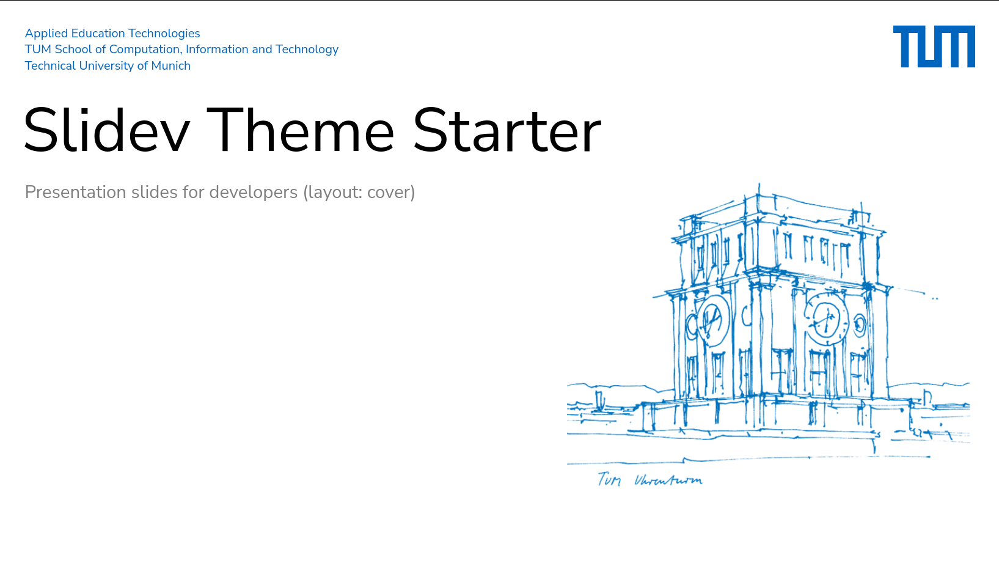
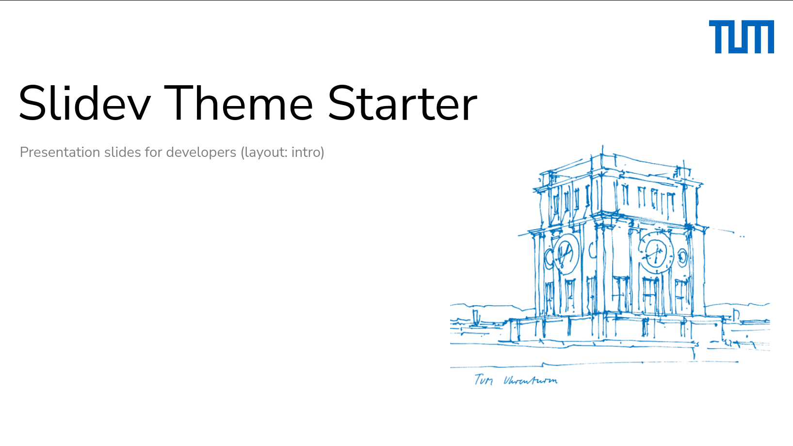
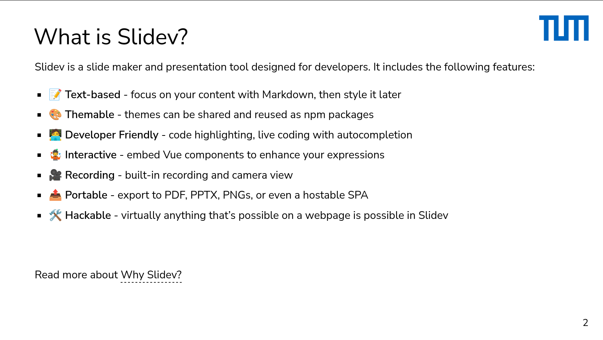
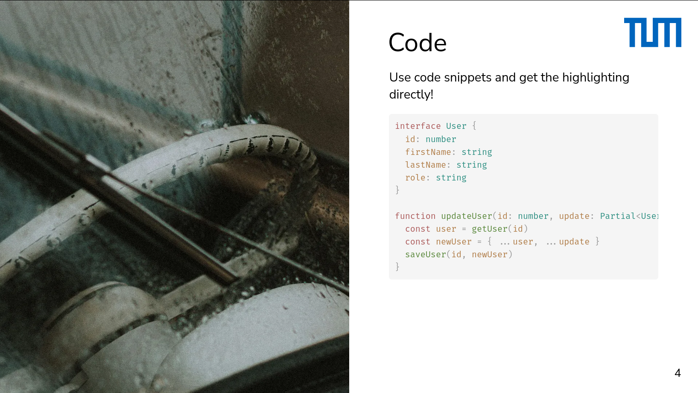

# slidev-theme-tum

A TUM (technical university of munich) theme for [Slidev](https://github.com/slidevjs/slidev).

## Install

Clone this repository into your sli.dev deployment and insert the following frontmatter in your file:

<pre><code>---
theme: <b>/path/to/tum/theme</b>
---</code></pre>

Learn more about [how to use a theme](https://sli.dev/guide/theme-addon#use-theme).

## Contributing

- `npm install`
- `npm run dev` to start theme preview of `example.md`
- Edit the `example.md` and style to see the changes
- `npm run export` to generate the preview PDF
- `npm run screenshot` to generate the preview PNG
